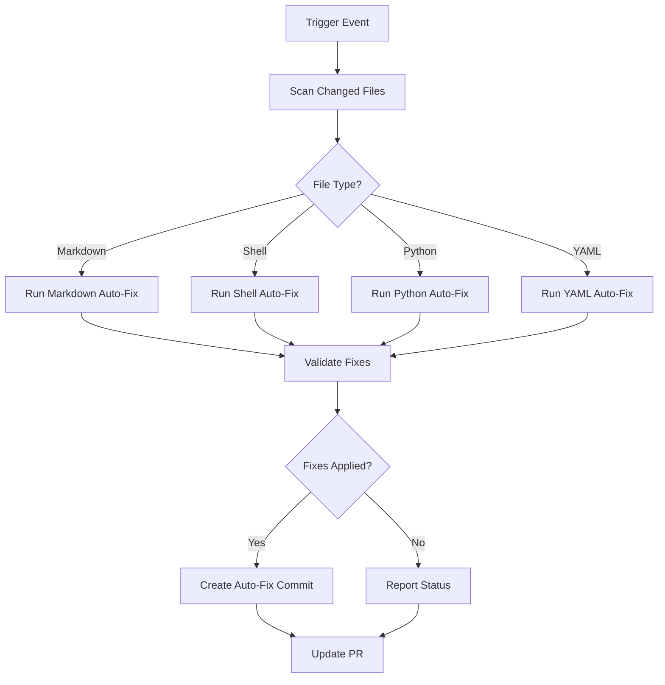

# Code Quality Auto-Fix Agent

## Agent Purpose

This agent automatically detects and fixes common linting and formatting issues across
the codebase, eliminating manual intervention for routine code quality problems.

## Core Functions

### 1. Markdown Auto-Fix

**Problems Detected & Fixed:**

- MD013 (line-length): Automatically wrap long lines at 100 characters
- MD022 (blanks-around-headings): Add proper spacing around headings
- MD032 (blanks-around-lists): Add blank lines around lists
- MD029 (ol-prefix): Fix ordered list numbering
- MD040 (fenced-code-language): Add language tags to code blocks
- MD058 (blanks-around-tables): Add spacing around tables
- MD009 (no-trailing-spaces): Remove trailing whitespace

**Auto-Fix Strategy:**

```bash
# Run markdownlint with auto-fix
markdownlint --fix "**/*.md" --ignore node_modules --ignore ".codex/**" --config .markdownlint.json
```

### 2. Shell Script Auto-Fix

**Problems Detected & Fixed:**

- SC2162: Add `-r` flag to `read` commands
- SC2086: Add quotes around variable expansions
- SC2034: Remove unused variables or add underscore prefix
- SC2164: Add `|| exit` to `cd` commands
- SC2129: Use `>>` instead of multiple `>` redirects

**Auto-Fix Strategy:**

```bash
# Apply common shellcheck fixes
find . -name "*.sh" -exec shellcheck --format=diff {} \; | patch
```

### 3. Python Auto-Fix

**Problems Detected & Fixed:**

- Black formatting issues
- Import organization (isort)
- Basic flake8 violations (trailing whitespace, line length)
- Unused imports

**Auto-Fix Strategy:**

```bash
# Auto-format Python code
black scripts/ --quiet
isort scripts/ --quiet
autoflake --remove-all-unused-imports --in-place scripts/*.py
```

### 4. YAML Auto-Fix

**Problems Detected & Fixed:**

- Indentation consistency
- Trailing spaces
- Document structure

**Auto-Fix Strategy:**

```bash
# Format YAML files
find . -name "*.yml" -o -name "*.yaml" | xargs -I {} sh -c 'yq eval . {} > {}.tmp && mv {}.tmp {}'
```

## Trigger Conditions

### Primary Triggers

1. **PR Creation**: Run full auto-fix on all changed files
2. **PR Update**: Fix only newly changed files
3. **File Change Events**: Real-time fixing for active development

### Exclusion Patterns

- Skip auto-fix if PR contains `[skip-autofix]` in title or description
- Preserve user-intended formatting in code blocks
- Skip binary files and generated content

## Execution Workflow



## Implementation

### Script Integration

```bash
#!/bin/bash
# .codex/scripts/auto_fix_quality.sh

set -euo pipefail

echo "🔧 Starting Code Quality Auto-Fix..."

# Get list of changed files
CHANGED_FILES=$(git diff --name-only HEAD^ HEAD)

# Process each file type
for file in $CHANGED_FILES; do
    case "$file" in
        *.md)
            echo "📝 Fixing markdown: $file"
            markdownlint --fix "$file" || true
            ;;
        *.sh)
            echo "🐚 Fixing shell script: $file"
            shellcheck --format=diff "$file" | patch || true
            ;;
        *.py)
            echo "🐍 Fixing Python: $file"
            black "$file" --quiet || true
            isort "$file" --quiet || true
            ;;
        *.yml|*.yaml)
            echo "📋 Fixing YAML: $file"
            yq eval . "$file" > "$file.tmp" && mv "$file.tmp" "$file" || true
            ;;
    esac
done

# Check if any changes were made
if ! git diff --quiet; then
    echo "✅ Auto-fixes applied, creating commit..."
    git add .
    git commit -m "CHORE(auto): fix code quality issues

$(git diff --name-only HEAD^ HEAD | sed 's/^/- /')"
else
    echo "ℹ️  No auto-fixes needed"
fi
```

### GitHub Action Integration

```yaml
name: Auto-Fix Code Quality
on:
  pull_request:
    types: [opened, synchronize]

jobs:
  auto-fix:
    runs-on: ubuntu-latest
    if: "!contains(github.event.pull_request.title, '[skip-autofix]')"
    steps:
    - uses: actions/checkout@v4
        with:
          token: ${{ secrets.GITHUB_TOKEN }}
          fetch-depth: 0

    - name: Setup Node.js
        uses: actions/setup-node@v4
        with:
          node-version: '18'

    - name: Setup Python
        uses: actions/setup-python@v5
        with:
          python-version: '3.12'

    - name: Install tools
        run: |
          npm install -g markdownlint-cli
          pip install black isort autoflake
          sudo apt-get install -y shellcheck yq

    - name: Run auto-fix
        run: |
          chmod +x .codex/scripts/auto_fix_quality.sh
          ./.codex/scripts/auto_fix_quality.sh

    - name: Push changes
        run: |
          if ! git diff --quiet; then
            git config --local user.email "action@github.com"
            git config --local user.name "Code Quality Agent"
            git push
          fi
```

## Success Metrics

- **Reduced Manual Interventions**: Track auto-fix commit frequency
- **CI Pass Rate**: Measure improvement in first-time CI pass rates
- **Developer Velocity**: Reduced time spent on formatting fixes
- **Code Quality Consistency**: Uniform formatting across all files

## Error Handling

### Safe Execution

- Always validate fixes don't break functionality
- Create backup before applying bulk changes
- Rollback capability for failed auto-fixes
- Human review for complex changes

### Failure Scenarios

1. **Auto-fix creates syntax errors**: Rollback and notify
2. **Conflicting fixes**: Skip auto-fix, create manual review issue
3. **Large-scale changes**: Require human approval for bulk operations

## Configuration

### .markdownlint.json Override

```json
{
  "default": true,
  "MD013": { "line_length": 100 },
  "MD033": { "allowed_elements": ["kbd", "br"] },
  "auto_fix_enabled": true
}
```

### Agent Settings

- `auto_commit`: Enable automatic commits
- `max_fixes_per_run`: Limit auto-fixes to prevent overwhelming changes
- `notification_threshold`: Notify on significant changes
- `rollback_enabled`: Allow automatic rollback on failures

## Benefits

✅ **Immediate**: Eliminates manual formatting work
✅ **Consistent**: Enforces uniform code quality standards
✅ **Proactive**: Catches issues before CI failures
✅ **Learning**: Improves developer habits through consistent feedback
✅ **Velocity**: Reduces development friction and review time

This agent transforms code quality from a reactive process to a proactive, automated
system that maintains high standards without developer intervention.
