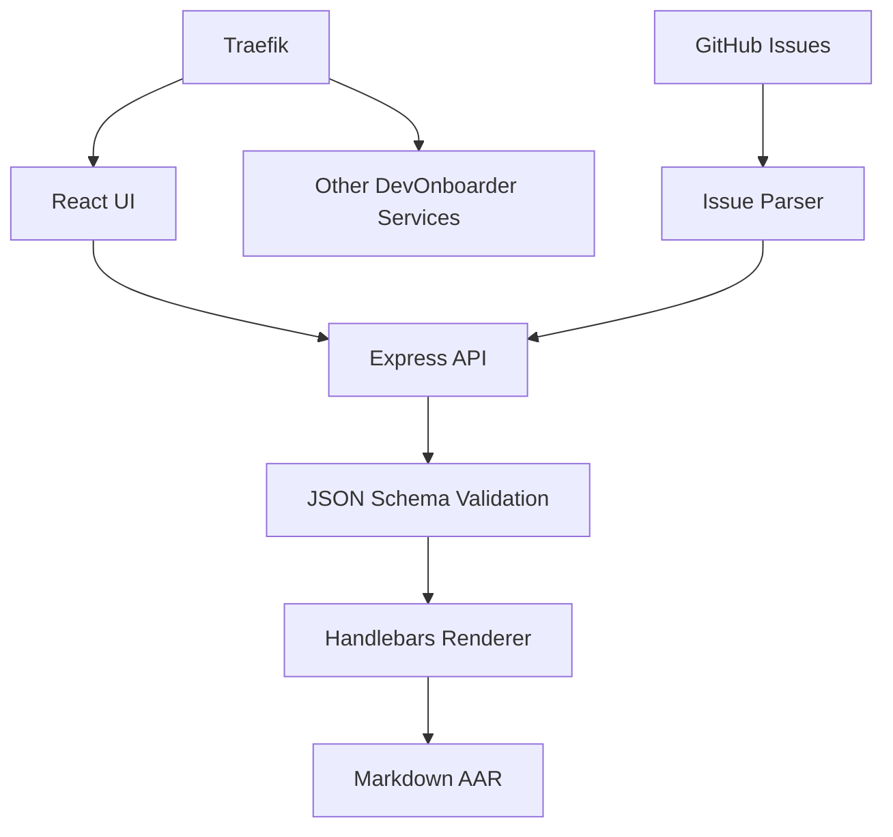

# DevOnboarder AAR UI

A React-based user interface for creating After Action Reports (AARs), integrated as a service in the DevOnboarder Docker stack. This UI provides a friendly form interface that writes the exact same `.aar.json` format as the schema-driven system and reuses the existing Handlebars renderer.

## Architecture



## Quick Start (Stack Integration)

```bash

# Setup (run once)

bash scripts/setup_aar_ui.sh

# Start as part of DevOnboarder stack

npm run aar:stack:up

# Access via Traefik

open https://aar.theangrygamershow.com

```

## URLs (Stack Deployment)

- **Production**: <https://aar.theangrygamershow.com> (via Traefik + Cloudflare)
- **Development**: <http://localhost> (via Traefik routing)
- **Health Check**: <http://localhost/api/health>
- **Traefik Dashboard**: <http://localhost:8090>

## Stack Features

### Schema Compliance

- Zod schema mirrors the JSON Schema exactly
- All validation rules enforced client-side
- No deviation from existing workflow
- DevOnboarder markdown standards compliance

### Infrastructure Reuse

- Uses your existing `scripts/render_aar.js`
- Same Handlebars templates
- Same JSON Schema validation
- No duplication of AAR logic

### Input Methods

- **React Form**: Technical users, full featured
- **GitHub Issue Import**: `/aar/from-issue/:number`
- **API**: `/api/aar/submit` JSON endpoint
- **Quick Mode**: Essential fields only

### Validation Features

- Client-side validation with Zod
- Real-time error feedback
- Field-by-field validation
- Schema mismatch prevention

## How It Works

1. **User fills React form** → Zod validates input → JSON created
2. **Express API receives JSON** → Validates against JSON Schema
3. **Calls existing `render_aar.js`** → Creates markdown file
4. **Saves to `docs/AAR/`** → Ready for commit

This means your existing workflow is unchanged, but now technical users have a friendly UI option.

## Form Configuration

### Required Fields

- **Title**: Initiative name
- **Date**: ISO format (YYYY-MM-DD)
- **Type**: Infrastructure, CI, Monitoring, etc.
- **Priority**: Critical, High, Medium, Low
- **Executive Summary**: Problem, Solution, Outcome

### Optional Fields

- **Success Metrics**: Measurable achievements
- **Challenges Overcome**: Issues resolved
- **Lessons Learned**: Key insights
- **Action Items**: Follow-up tasks with owners
- **References**: Related documentation
- **Participants**: Team members involved

## API Integration

```json

POST /api/aar/submit
Content-Type: application/json

{
  "title": "Infrastructure Improvement",
  "date": "2025-01-15",
  "type": "Infrastructure",
  "priority": "High",
  "executive_summary": {
    "problem": "...",
    "solution": "...",
    "outcome": "..."
  }
  // ... other fields
}

```

## File Structure

```bash

app/aar-ui/
├── src/
│   ├── AARForm.tsx           # Main React form
│   ├── types.ts              # TypeScript types
│   └── main.tsx              # React app entry
├── lib/
│   └── aar.zod.ts            # Zod schema (mirrors JSON)
├── Dockerfile                # Multi-stage build (React + Express)
└── README.md
scripts/aar_api/
└── server.ts                 # Express API server

```

## Docker Integration

The AAR UI is integrated as a proper DevOnboarder service:

```yaml

# docker-compose.dev.yaml

services:
  aar-ui:
    build: ./app/aar-ui
    networks:
      - edge_tier
    labels:
      - "traefik.http.routers.aar-ui.rule=Host(`aar.theangrygamershow.com`)"

```

## Validation Benefits

- **Schema-driven**: No manual editing needed
- **Zero flakiness**: Generated markdown always passes linting
- **Type safety**: TypeScript + Zod validation
- **Real-time feedback**: Field-level error messages

## Features

### ✅ **Complete Schema Compliance**

- Zod schema mirrors the JSON Schema exactly
- Full validation before submission
- Error handling with field-level feedback

### ✅ **Reuses Existing Infrastructure**

- Uses your existing `scripts/render_aar.js`
- Same Handlebars templates
- Same markdown output format
- Same validation pipeline

### ✅ **Multiple Input Methods**

- **React Form**: Technical users, full featured
- **GitHub Issues**: Non-technical users, auto-processed
- **Direct JSON**: Developers, programmatic access

### ✅ **Real-time Validation**

- Client-side validation with Zod
- Server-side validation with JSON Schema
- Immediate feedback on form errors

## API Endpoints

| Method | Endpoint | Description |
|--------|----------|-------------|
| `GET` | `/api/health` | System health check |
| `POST` | `/api/aar/submit` | Submit new AAR |
| `GET` | `/api/aar/list` | List existing AARs |
| `GET` | `/api/aar/:filename` | Get specific AAR data |
| `GET` | `/api/aar/:filename/report` | Get rendered markdown report |

## Form Fields

### Required

- **Title**: Initiative name
- **Date**: Completion date (YYYY-MM-DD)
- **Type**: Infrastructure, CI, Monitoring, Documentation, Feature, Security
- **Priority**: Critical, High, Medium, Low
- **Executive Summary**: Problem, Solution, Outcome
- **Phases**: At least one project phase with name, duration, status, description

### Optional

- **Success Metrics**: Measurable achievements
- **Challenges Overcome**: Significant obstacles addressed
- **Follow-up Actions**: Outstanding action items with owners and due dates
- **Lessons Learned**: Key insights for future initiatives
- **References**: Related documentation and resources

## Development Scripts

```bash

# Install dependencies

npm run aar:ui:install

# Development (React + API)

npm run aar:demo

# Individual services

npm run aar:ui:dev        # React UI only
npm run aar:api:dev       # Express API only

# Production

npm run aar:ui:build      # Build for production
npm run aar:ui:serve      # Serve production build

# Testing

cd app/aar-ui && npm test
cd app/aar-ui && npm run type-check

```

## Integration with DevOnboarder

### Project Directory Layout

```bash

app/aar-ui/
├── lib/aar.zod.ts          # Zod schema (mirrors JSON Schema)
├── src/AARForm.tsx         # Main React form component
├── src/main.tsx            # App entry point
├── src/index.css           # Tailwind styles
├── package.json            # Dependencies
├── vite.config.ts          # Vite configuration
└── tsconfig.json           # TypeScript configuration

scripts/
├── aar_api/server.ts       # Express API server
├── issue_to_aar_json.js    # GitHub Issue parser
└── setup_aar_ui.sh        # Quick setup script

```

### Workflow Integration

1. **React Form** → Validates with Zod → Submits to Express API
2. **Express API** → Validates with JSON Schema → Saves JSON → Calls `render_aar.js`
3. **GitHub Issues** → Parsed by workflow → JSON created → Rendered → Comment posted
4. **All paths** → Use same validation → Same output format → Same storage location

### GitHub Issue Form

Non-technical users can create AARs via GitHub Issues:

1. Use the "After Action Report" issue template
2. Fill out the form fields
3. Submit issue with `aar` label
4. Automated workflow processes issue → JSON → rendered AAR
5. Rendered AAR posted as issue comment

## Configuration

### Environment Variables

```bash

# API Server

AAR_API_PORT=3001                    # API server port
FRONTEND_URL=http://localhost:5174   # React UI URL for CORS

# Development

NODE_ENV=development

```

### Proxy Configuration

The React dev server proxies API requests to the Express server:

```yaml

// vite.config.ts
server: {
  port: 5174,
  proxy: {
    '/api': {
      target: 'http://localhost:3001',
      changeOrigin: true
    }
  }
}

```

## Security Features

- **CORS Protection**: Configurable allowed origins
- **Input Validation**: Both client and server-side validation
- **Schema Enforcement**: Strict JSON Schema compliance
- **File Safety**: Generated filenames sanitized
- **Error Handling**: Secure error messages without exposing internals

## Troubleshooting

### Common Issues

#### Port Already in Use

```bash

# Check what's using the port

lsof -i :3001
lsof -i :5174

# Use different ports

AAR_API_PORT=3002 npm run aar:api:dev

```

#### Dependencies Missing

```bash

# Reinstall dependencies

rm -rf app/aar-ui/node_modules
npm run aar:ui:install

```

#### API Connection Failed

```text

# Verify API is running

curl http://localhost:3001/api/health

# Check proxy configuration in vite.config.ts

```

#### Validation Errors

```bash

# Test core AAR system

npm run aar:full-test

# Check JSON Schema is valid

npm run aar:validate-schema docs/AAR/schema/aar.schema.json

```

## Production Deployment

### Build Process

```bash

# Build both API and UI

npm run aar:ui:build

# Output locations

app/aar-ui/dist/          # Built React app
app/aar-ui/dist/api/      # Compiled Express server

```

### Deployment Options

#### Option 1: Serve with Express

```bash

npm run aar:ui:serve      # Serves React + API together

```

#### Option 2: Static + Separate API

```bash

# Serve React build with nginx/Apache
# Run Express API separately

npm run aar:api:serve

```

#### Option 3: Container Deployment

```dockerfile

# Example Dockerfile

FROM node:22-alpine
COPY app/aar-ui/dist/ /app/
WORKDIR /app
EXPOSE 3001
CMD ["node", "api/server.js"]

```

## Integration with Existing Frontend

To integrate with your existing DevOnboarder frontend:

```python

// Import the AAR form component
import AARForm from '../app/aar-ui/src/AARForm';

// Use in your existing React app
function AARPage() {
  return (
    <div className="max-w-7xl mx-auto py-6 sm:px-6 lg:px-8">
      <AARForm onSubmit={(data) => {
        // Custom submission handler if needed
        console.log('AAR submitted:', data);
      }} />
    </div>
  );
}

```

## Future Enhancements

- **PDF Export**: Automated PDF generation using Puppeteer
- **Dashboard**: View and manage existing AARs
- **Templates**: Pre-filled forms for common initiative types
- **Collaboration**: Multi-user editing and review workflows
- **Analytics**: Initiative outcome tracking and metrics
- **Integration**: Connect with project management tools

---

**Ready to ship!** This implementation reuses your rock-solid schema + renderer + CI while adding the friendly React form interface you requested. 🚀
