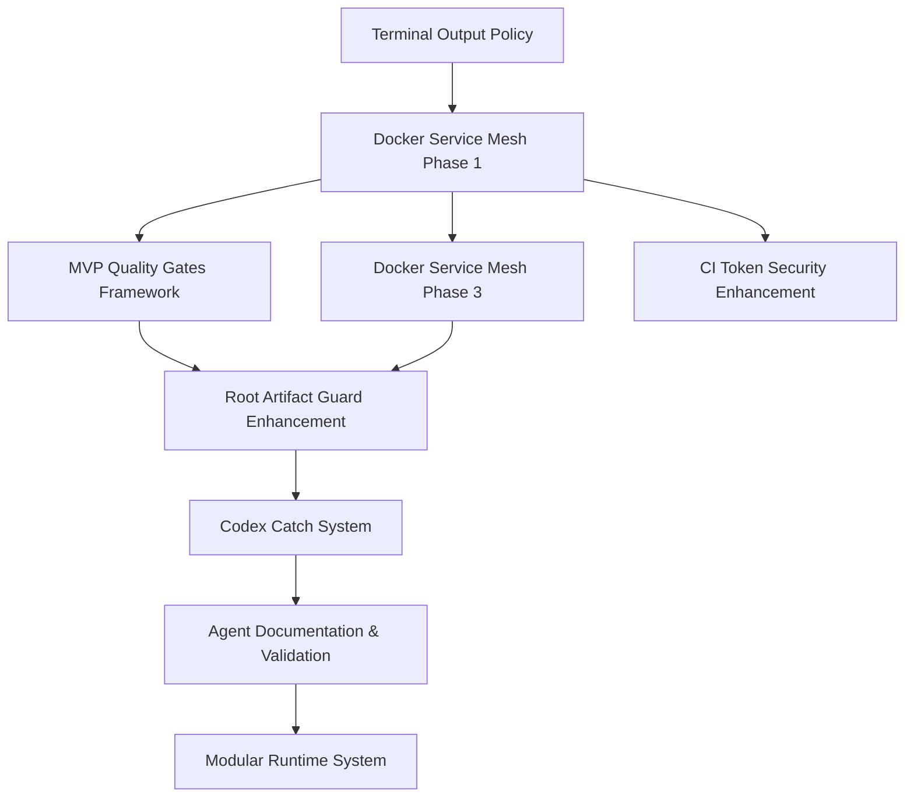

# 🧠 DevOnboarder Integrated Task Staging & Execution Order

## 🎯 Executive Summary

**Strategic Integration**: Our Docker Service Mesh implementation integrates perfectly with existing staged tasks. Several tasks need reordering and adjustment to maximize synergy and minimize risk.

**Key Insight**: The staged tasks create a **foundational quality platform** that our Docker Service Mesh can leverage, while our infrastructure work **enables** several advanced staged tasks.

## 📊 Task Integration Analysis

### ✅ **PHASE 1: MVP Foundation** (Weeks 1-2)

**Goal**: Establish stable infrastructure and quality enforcement before advanced features

#### 1.1 Critical Infrastructure (Week 1)

```yaml
Priority: P0 (MVP Blocking)
Order: FIRST - Everything depends on this
```

**Tasks to Execute:**

- [ ] **Terminal Output Policy Completion** (22 → ≤10 violations)

    - **Status**: Enhanced enforcement system staged
    - **Integration**: Required for our Docker Service Mesh CI validation
    - **Files**: `enhanced_terminal_output_valdation_and_enforcement_system.md`

- [ ] **Docker Service Mesh Phase 1** (NEW - Our Implementation)
    - **Dependencies**: Terminal output cleanup complete
    - **Integration**: Provides network foundation for all subsequent tasks
    - **Enables**: Modular runtime, agent validation, security enhancement

#### 1.2 Quality Framework (Week 2)

```yaml
Priority: P0 (MVP Quality Gates)
Order: SECOND - Builds on infrastructure
```

**Tasks to Execute:**

- [ ] **MVP Quality Gates Framework** (`implement_mvp_quality_gates_framework.md`)
    - **Integration**: Enhanced by our Docker Service Mesh Phase 3 (CI validation)
    - **Dependencies**: Terminal output compliance, network foundation

- [ ] **Docker Service Mesh Phase 3** (NEW - Our Implementation)
    - **Integration**: Provides network contract validation for quality gates
    - **Enhancement**: Strengthens CI enforcement capabilities

### 🚀 **PHASE 2: Enhanced Capabilities** (Weeks 3-4)

**Goal**: Implement advanced monitoring, automation, and observability

#### 2.1 Advanced Infrastructure (Week 3)

```yaml
Priority: P1 (MVP Enhancement)
Order: THIRD - Requires stable foundation
```

**Tasks to Execute:**

- [ ] **Root Artifact Guard Enhancement** (`root_artifcact_guard_and_ci_hygiene_system_enhancement.md`)
    - **Integration**: Works with our network validation in CI
    - **Synergy**: Both enforce infrastructure hygiene

- [ ] **Codex Catch System** (`implement_codex_catch_system.md`)
    - **Dependencies**: Terminal output cleanup, CI stability from Phase 1
    - **Integration**: Benefits from Docker Service Mesh network isolation

#### 2.2 Advanced Automation (Week 4)

```yaml
Priority: P1 (Strategic)
Order: FOURTH - Requires all foundations
```

**Tasks to Execute:**

- [ ] **Agent Documentation & Validation** (`agent_documentation_and_validation_system_enhancement.md`)
    - **Integration**: Can leverage our network topology for agent routing
    - **Dependencies**: Infrastructure stable, quality gates operational

- [ ] **CI Workflow Token Security** (`ci_workflow_token_security_and_authentication_enhancement.md`)
    - **Integration**: Enhanced by network security boundaries
    - **Dependencies**: Network isolation, quality enforcement

### 🔮 **PHASE 3: Post-MVP Advanced Features** (Weeks 5-6)

**Goal**: Implement comprehensive observability and modular architecture

#### 3.1 Modular Architecture

- [ ] **Modular Runtime & Module Manifest** (`implement_modular_runtime_and_module_manifest.md`)
    - **Integration**: Leverages Docker Service Mesh service discovery
    - **Dependencies**: Network foundation, agent validation system

#### 3.2 Advanced Observability

- [ ] **Docker Service Mesh Phases 2, 4, 5** (Our Post-MVP Implementation)
    - **Codex Integration**: Network topology agents
    - **Documentation**: Comprehensive architecture diagrams
    - **Advanced Monitoring**: Violation logging and network health

## 🔄 **Revised Task Staging Strategy**

### **IMMEDIATE ADJUSTMENTS NEEDED:**

1. **Move Terminal Output Enhancement to P0**
   - **Current**: Staged
   - **New**: Active (Week 1)
   - **Reason**: Blocks Docker Service Mesh CI validation

2. **Integrate Docker Service Mesh as Foundation**
   - **Current**: Not in staged tasks
   - **New**: Phase 1 (Weeks 1-2) + Post-MVP phases
   - **Reason**: Enables multiple staged tasks

3. **Defer Modular Runtime to Phase 3**
   - **Current**: Staged for earlier implementation
   - **New**: Post-MVP (Week 5)
   - **Reason**: Requires network foundation and agent system

4. **Prioritize Quality Gates Framework**
   - **Current**: Staged
   - **New**: Phase 1 (Week 2)
   - **Reason**: MVP-critical, enhanced by network validation

### **DEPENDENCY CHAIN ANALYSIS:**



## 📋 **Updated Execution Order**

> **📝 Documentation Note**: Roman numerals (I, II, III, etc.) are used for split ordered lists across sections to avoid MD029 markdown linting violations. When creating ordered lists that span multiple sections or headings, always use Roman numerals instead of Arabic numerals to maintain consistent formatting and prevent linting errors.

### **Week 1: Foundation**

I. **Terminal Output Enhancement** (Critical)
II. **Docker Service Mesh Phase 1** (Network Foundation)

### **Week 2: Quality Framework**

III. **MVP Quality Gates Framework** (Application Quality)
IV. **Docker Service Mesh Phase 3** (Infrastructure Quality)

### **Week 3: Advanced Infrastructure**

V. **Root Artifact Guard Enhancement** (CI Hygiene)
VI. **Codex Catch System** (Coverage Automation)

### **Week 4: Security & Validation**

VII. **Agent Documentation & Validation** (Agent Framework)
VIII. **CI Token Security Enhancement** (Security Hardening)

### **Week 5-6: Post-MVP Advanced**

IX. **Modular Runtime System** (Architecture Evolution)
X. **Docker Service Mesh Phases 2, 4, 5** (Advanced Observability)

## 🎯 **Integration Benefits**

### **Synergies Created:**

1. **Terminal Output + Docker CI** = Reliable infrastructure validation
2. **Quality Gates + Network Contracts** = Comprehensive enforcement
3. **Root Artifact Guard + Network Isolation** = Complete hygiene system
4. **Agent Validation + Service Discovery** = Intelligent routing
5. **Token Security + Network Boundaries** = Defense in depth

### **Risk Mitigation:**

- **Foundation First**: Infrastructure stable before advanced features
- **Incremental Implementation**: Each phase builds on previous
- **Quality Gates**: Continuous validation at every level
- **Rollback Strategy**: Each phase independently deployable

## ✅ **Recommended Actions**

1. **Begin Terminal Output Enhancement immediately** - Critical for foundation stability
2. **Prepare Docker Service Mesh Phase 1 environment** - Network foundation setup
3. **Review quality gate requirements** - Ensure MVP standards are clearly defined
4. **Validate token security requirements** - Security hardening prerequisites
5. **Establish rollback procedures** - Each phase must be independently deployable

---

**Result**: Coordinated implementation plan that maximizes task synergy while maintaining MVP delivery timeline and quality standards.
