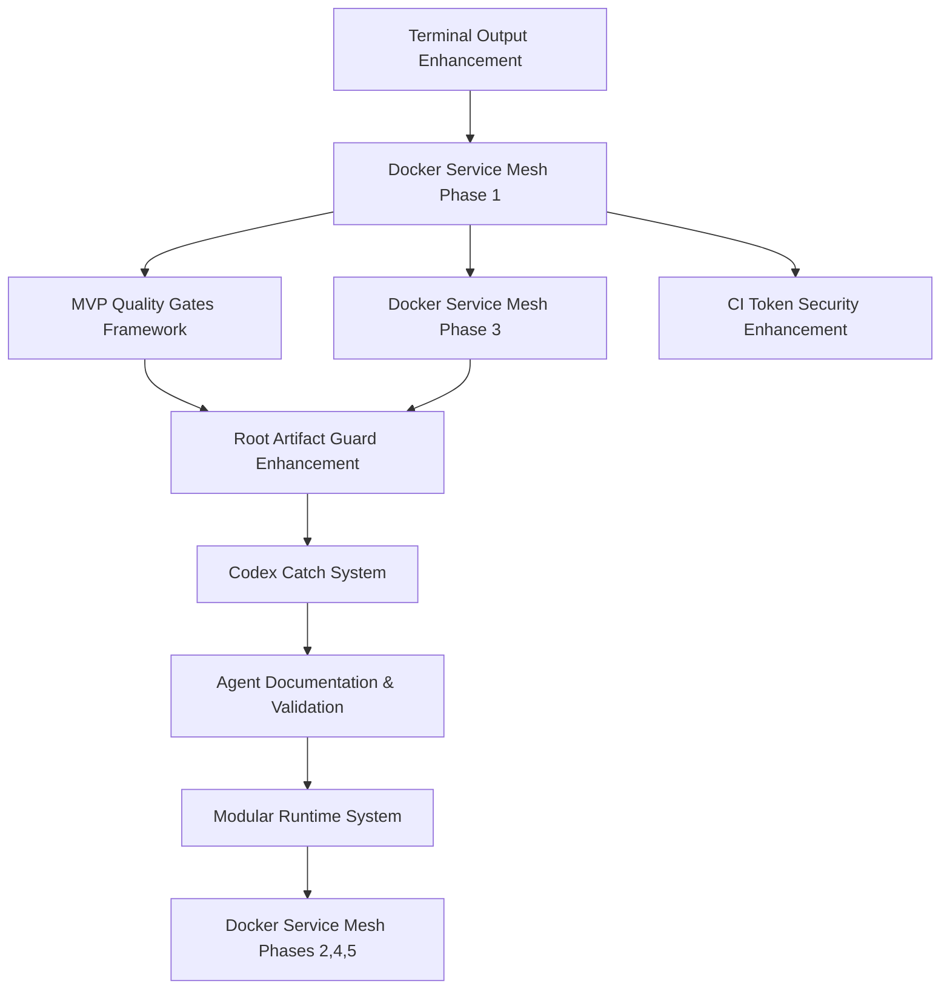

# DevOnboarder Task Execution Order & Dependencies

## Executive Summary

**Mission**: Execute optimal 4-week MVP delivery with Docker Service Mesh foundation enabling advanced capabilities.

**Key Strategy**: Foundation-first approach with realistic timeline targeting August 30, 2025 completion.

**Timeline**: 4-week coordinated implementation with buffer week for MVP completion.

## Critical Path Analysis

### Foundation Dependencies



## Execution Timeline

### Week 1: Infrastructure Foundation (P0 - MVP Blocking)

#### Task 1: Terminal Output Enhancement

- **Status**: Move from Staged → Active
- **Priority**: CRITICAL (Blocks everything)
- **Goal**: 22 → ≤10 violations
- **Files**: `enhanced_terminal_output_valdation_and_enforcement_system.md`
- **Deliverables**: Zero tolerance enforcement, CI integration
- **Success Criteria**: All network validation scripts pass terminal output compliance

#### Task 2: Docker Service Mesh Phase 1

- **Status**: NEW - Add to Active
- **Priority**: CRITICAL (Foundation)
- **Goal**: Tiered network architecture
- **Files**: Network foundation scripts, docker-compose updates
- **Deliverables**: `auth_tier`, `api_tier`, `data_tier` networks
- **Success Criteria**: All services operational in correct network tiers

### Week 2: Quality Framework (P0 - MVP Quality)

#### Task 3: MVP Quality Gates Framework

- **Status**: Move from Staged → Active
- **Priority**: CRITICAL (MVP requirement)
- **Goal**: Comprehensive quality enforcement
- **Files**: `implement_mvp_quality_gates_framework.md`
- **Deliverables**: Automated quality validation, performance benchmarks
- **Success Criteria**: 95% quality threshold maintained

#### Task 4: Docker Service Mesh Phase 3

- **Status**: NEW - Add to Active
- **Priority**: CRITICAL (CI integration)
- **Goal**: Network contract enforcement
- **Files**: CI validation workflows, pre-commit hooks
- **Deliverables**: Zero tolerance for network violations
- **Success Criteria**: CI blocks all network contract violations

### Week 3: Advanced Infrastructure (P1 - MVP Enhancement)

#### Task 5: Root Artifact Guard Enhancement

- **Status**: Keep Staged → Activate Week 3
- **Priority**: HIGH (CI hygiene)
- **Goal**: Comprehensive artifact management
- **Files**: `root_artifcact_guard_and_ci_hygiene_system_enhancement.md`
- **Deliverables**: Enhanced detection, automated cleanup
- **Success Criteria**: Zero root pollution in CI/CD

#### Task 6: Codex Catch System

- **Status**: Keep Staged → Activate Week 3
- **Priority**: HIGH (Coverage automation)
- **Goal**: Coverage decay prevention
- **Files**: `implement_codex_catch_system.md`
- **Deliverables**: Automated test backlog management
- **Success Criteria**: No coverage regressions in MVP

### Week 4: Security & Validation (P1 - Strategic)

#### Task 7: Agent Documentation & Validation

- **Status**: Keep Staged → Activate Week 4
- **Priority**: MEDIUM (Agent framework)
- **Goal**: Comprehensive agent validation system
- **Files**: `agent_documentation_and_validation_system_enhancement.md`
- **Deliverables**: Agent routing, validation framework
- **Success Criteria**: All agents properly documented and validated

#### Task 8: CI Token Security Enhancement

- **Status**: Keep Staged → Activate Week 4
- **Priority**: MEDIUM (Security hardening)
- **Goal**: Enhanced authentication security
- **Files**: `ci_workflow_token_security_and_authentication_enhancement.md`
- **Deliverables**: Token hierarchy, fine-grained permissions
- **Success Criteria**: All CI workflows use proper token hierarchy

### Week 5-6: Post-MVP Advanced (P2 - Strategic Evolution)

#### Task 9: Modular Runtime System

- **Status**: Keep Staged → Activate Week 5
- **Priority**: LOW (Post-MVP)
- **Goal**: Modular architecture foundation
- **Files**: `implement_modular_runtime_and_module_manifest.md`
- **Deliverables**: Module manifest system, runtime management
- **Success Criteria**: Clean modular architecture for future development

#### Task 10: Docker Service Mesh Advanced

- **Status**: NEW - Add to Post-MVP
- **Priority**: LOW (Post-MVP observability)
- **Goal**: Advanced monitoring and documentation
- **Files**: Phases 2, 4, 5 implementation
- **Deliverables**: Codex integration, comprehensive docs, violation logging
- **Success Criteria**: Full observability and advanced network features

## Task Status Changes Required

### Immediate Activations (Week 1)

```yaml
terminal_output_enhancement:
  status: staged → active
  priority: critical
  start_date: 2025-08-08
  target_completion: 2025-08-15

docker_service_mesh_phase1:
  status: new → active
  priority: critical
  start_date: 2025-08-08
  target_completion: 2025-08-15
```

### Scheduled Activations

```yaml
mvp_quality_gates:
  status: staged → scheduled_active
  priority: critical
  start_date: 2025-08-15
  target_completion: 2025-08-22

docker_service_mesh_phase3:
  status: new → scheduled_active
  priority: critical
  start_date: 2025-08-15
  target_completion: 2025-08-22

root_artifact_guard:
  status: staged → scheduled_active
  priority: high
  start_date: 2025-08-22
  target_completion: 2025-08-29

codex_catch_system:
  status: staged → scheduled_active
  priority: high
  start_date: 2025-08-22
  target_completion: 2025-08-29
```

## Success Metrics by Week

### Week 1 Targets

- Terminal output violations: 22 → ≤10
- Network tiers: 0 → 3 (auth, api, data)
- Service isolation: 0% → 100% (data tier)

### Week 2 Targets

- Quality gates: 0 → 8 metrics enforced
- CI network validation: 0% → 100% coverage
- Network contract violations: Any → 0

### Week 3 Targets

- Root artifact pollution: Detected → 0 violations
- Coverage decay prevention: Manual → Automated
- CI hygiene score: Current → 95%

### Week 4 Targets

- Agent validation: Manual → Automated
- Token security: Basic → Enhanced hierarchy
- Documentation coverage: Partial → Complete

### Week 5-6 Targets

- Modular architecture: Monolithic → Modular ready
- Advanced observability: Basic → Comprehensive
- Network monitoring: Manual → Automated

## Integration Points

### Synergy Opportunities

1. **Terminal Output + Docker CI** = Reliable infrastructure validation
2. **Quality Gates + Network Contracts** = Comprehensive enforcement
3. **Root Artifact Guard + Network Isolation** = Complete hygiene
4. **Agent Validation + Service Discovery** = Intelligent routing
5. **Token Security + Network Boundaries** = Defense in depth

### Risk Mitigation

- **Foundation First**: Infrastructure stable before advanced features
- **Incremental Rollout**: Each week builds on previous
- **Quality Gates**: Continuous validation at every level
- **Rollback Capability**: Each task independently deployable

## Resource Allocation

### Development Team Focus

**Week 1-2**: Infrastructure Team (2 developers)
**Week 3-4**: Full Stack Team (3 developers)
**Week 5-6**: Architecture Team (2 developers)

### CI/CD Resources

**Week 1**: Enhanced monitoring, additional validation workflows
**Week 2**: Network contract enforcement, quality gate integration
**Week 3**: Advanced artifact management, coverage automation
**Week 4**: Security hardening, agent framework deployment

## Implementation Readiness

### Prerequisites Completed

- [x] Task dependency analysis
- [x] Resource allocation planning
- [x] Success metrics definition
- [x] Risk mitigation strategy

### Ready for Execution

- [x] Clear task ordering established
- [x] Integration points identified
- [x] Timeline validated against MVP goals
- [x] Rollback procedures defined

---

**Last Updated**: August 8, 2025
**Status**: Ready for Implementation
**Next Action**: Update Codex task index and GitHub Projects board
