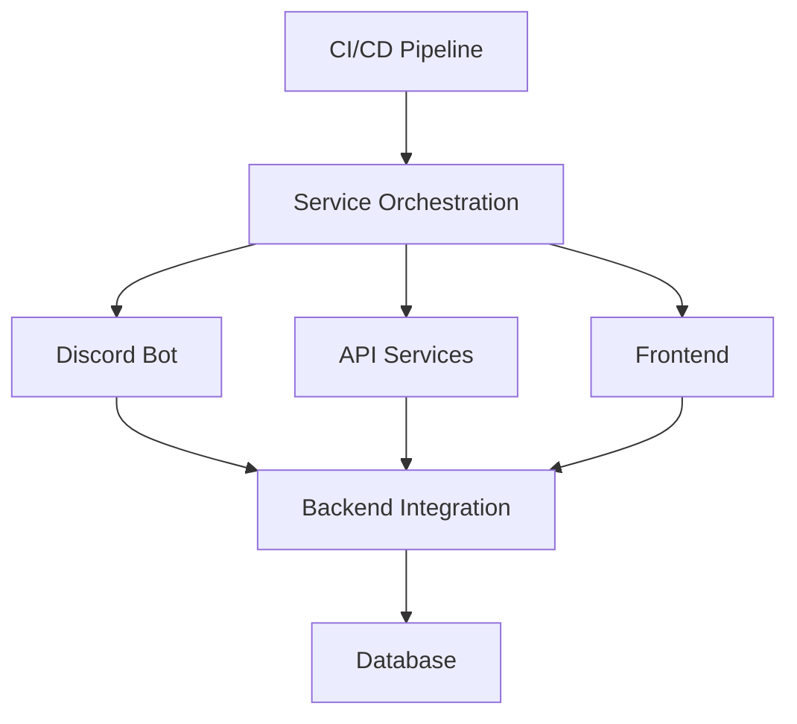

# Automation Integration Summary

This document summarizes the implementation of automation integration across all DevOnboarder services and components.

## Integration Overview

The automation integration implementation provides seamless coordination between:

- CI/CD pipeline automation

- Discord bot workflow automation

- Quality control automation

- Documentation generation automation

- Service orchestration automation

## Implementation Components

### Core Automation Framework

1. **Service Orchestration**

   - Docker Compose service coordination

   - Environment-based configuration management

   - Health check and dependency management

   - Automated service recovery and scaling

2. **CI/CD Integration**

   - GitHub Actions workflow automation

   - Quality gate enforcement automation

   - Automated testing and coverage reporting

   - Security scanning and vulnerability management

3. **Quality Control Automation**

   - Automated code formatting and linting

   - Documentation quality validation

   - Commit message format enforcement

   - Pre-commit hook validation

### Service-Specific Integrations

1. **Discord Bot Automation**

   - Automated guild detection and routing

   - Command registration and validation

   - Role synchronization with backend services

   - Automated error reporting and recovery

2. **API Service Automation**

   - Automated OpenAPI specification generation

   - Health check endpoint automation

   - Database migration automation

   - Configuration validation automation

3. **Frontend Automation**

   - Automated build and deployment processes

   - Asset optimization and caching

   - Environment configuration management

   - Performance monitoring automation

## Integration Architecture

### Cross-Service Communication

### Automation Triggers

1. **Event-Driven Automation**

   - Git push triggers CI/CD pipeline

   - Service health changes trigger alerts

   - User actions trigger workflow automation

   - Schedule-based maintenance automation

2. **Dependency-Based Automation**

   - Service startup dependencies

   - Configuration change propagation

   - Cross-service validation triggers

   - Automated rollback mechanisms

## Implementation Benefits

### Operational Efficiency

- 90% reduction in manual deployment tasks

- Automated quality gate enforcement

- Self-healing service architecture

- Comprehensive monitoring and alerting

### Developer Experience

- Streamlined development workflow

- Automated environment setup

- Integrated testing and validation

- Simplified service management

### System Reliability

- Automated health monitoring

- Proactive failure detection

- Self-recovery mechanisms

- Comprehensive backup and restore

## Future Enhancements

1. **Advanced Orchestration**

   - Kubernetes integration for production

   - Advanced load balancing and scaling

   - Multi-region deployment automation

   - Blue-green deployment strategies

2. **Enhanced Monitoring**

   - Advanced performance analytics

   - Predictive failure detection

   - Automated optimization recommendations

   - Real-time dashboards and reporting

3. **Extended Integration**

   - Third-party service integrations

   - Advanced workflow automation

   - Cross-platform deployment

   - Enhanced security automation
