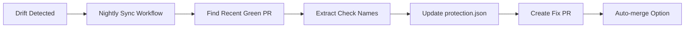

# Self-Healing CI Governance - Usage Guide

## 🔧 Automatic Drift Correction System

DevOnboarder's CI governance framework now includes self-healing capabilities that automatically detect and fix configuration drift.

## How It Works



## 🕐 Automated Schedule

| Time | Workflow | Purpose |
|------|----------|---------|
| **02:17 UTC** | Drift Detection | Identify configuration mismatches |
| **03:23 UTC** | Self-Healing Sync | Generate fix PR automatically |

## 🛠️ Manual Usage

### Sync from Specific PR

```bash
# Sync required checks from a known-good green PR
./scripts/sync_required_checks_from_pr.sh 1123

# This will:
# 1. Extract check names from PR #1123
# 2. Update protection.json with live check names
# 3. Create branch: chore/sync-required-checks-from-pr-1123
# 4. Commit changes with descriptive message
# 5. Push branch and create PR with auto-generated description
```

### Trigger Manual Sync Workflow

```bash
# Trigger nightly sync manually with specific PR
gh workflow run nightly-required-checks-sync.yml -f source_pr=1123

# Or trigger with auto-detection of recent PR
gh workflow run nightly-required-checks-sync.yml
```

## 📋 Self-Healing Process

### 1. Detection Phase (02:17 UTC)

```bash
# Nightly drift detection runs:
./scripts/verify-branch-protection.sh
./scripts/matrix_drift_protection.sh  
./scripts/audit-workflow-headers.sh

# If drift detected:
# - Creates GitHub issue with remediation guidance
# - Sets up conditions for self-healing
```

### 2. Self-Healing Phase (03:23 UTC)

```bash
# Automatic sync workflow runs:
# 1. Finds most recent merged PR
# 2. Checks if drift correction needed
# 3. Extracts live check names from green PR
# 4. Updates protection.json
# 5. Creates fix PR with detailed description
```

### 3. Resolution Phase (Manual)

```bash
# Review auto-generated PR:
# - Verify check names are correct
# - Confirm no sensitive changes
# - Merge to apply protection updates

# Validation after merge:
./scripts/verify-branch-protection.sh
```

## 🎯 Use Cases

### Scenario 1: New CI Workflow Added

```bash
# Problem: New workflow adds check "security-scan"
# Current protection.json doesn't include it
# Branch protection becomes ineffective

# Solution: Self-healing detects missing check
# Creates PR to add "security-scan" to protection.json
# Maintains branch protection effectiveness
```

### Scenario 2: Workflow Renamed

```bash
# Problem: CI workflow renames "test" to "test-suite"
# protection.json still references old "test" name
# Branch protection waits for non-existent check

# Solution: Self-healing extracts current check names
# Updates protection.json with "test-suite"
# Removes reference to obsolete "test"
```

### Scenario 3: Check Name Changes

```bash
# Problem: External action updates check names
# "build / build" becomes "build / compile"
# Protection configuration misaligned

# Solution: Automatic sync from green PR
# Captures exact current check naming
# Updates protection with live check names
```

## 🚨 Emergency Manual Fix

If self-healing fails or you need immediate correction:

```bash
# 1. Find a recent green PR number
gh pr list --search "is:merged" --limit 5

# 2. Run sync script manually
./scripts/sync_required_checks_from_pr.sh <PR_NUMBER>

# 3. Review and merge the generated PR

# 4. Verify protection is working
./scripts/verify-branch-protection.sh
```

## ⚙️ Configuration

### Workflow Timing

Modify `.github/workflows/nightly-required-checks-sync.yml`:

```yaml
on:
  schedule:
    - cron: "23 3 * * *"  # Change time if needed
```

### Auto-merge Settings

To enable auto-merge for drift fix PRs:

```bash
# Add to workflow after PR creation:
gh pr merge --auto --squash
```

## 📊 Monitoring

### Check Self-Healing Status

```bash
# View recent workflow runs
gh run list --workflow=nightly-required-checks-sync.yml

# Check for auto-generated fix PRs  
gh pr list --label=drift-fix,auto-generated

# Verify current protection state
./scripts/verify-branch-protection.sh
```

### Validation Commands

```bash
# Test sync script locally (dry run)
gh pr view 1123 --json headRefOid -q .headRefOid

# Validate protection.json syntax
jq . protection.json

# Test complete governance framework
./scripts/qc_pre_push.sh
```

## 🎯 Success Metrics

- **Zero manual intervention** required for common drift scenarios
- **< 24 hour resolution** for configuration mismatches
- **Automatic documentation** via detailed PR descriptions
- **Preservation of security** - all protection settings maintained
- **Developer experience** - transparent and well-documented fixes

## 📚 Related Documentation

- `docs/security/ci-governance-framework-complete-summary.md` - Complete framework overview
- `docs/security/final-hardening-toggles-guide.md` - Additional security measures
- `protection.json` - Source of truth for branch protection configuration
- `.github/workflows/nightly-drift-checks.yml` - Detection workflow
- `.github/workflows/nightly-required-checks-sync.yml` - Self-healing workflow

---

**Self-Healing Status**: ✅ OPERATIONAL  
**Detection**: Every 24 hours at 02:17 UTC  
**Auto-Fix**: Every 24 hours at 03:23 UTC  
**Manual Override**: Available via workflow_dispatch and script execution
